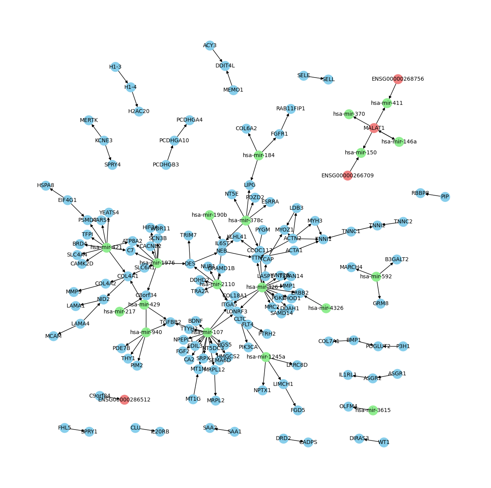

# RNACOREX 2.0

RNACOREX 2.0 is a package that extracts coregulation networks associated to a specific phenotype. The networks are composed of interactions between mRNAs, miRNAs and lncRNAs. The package uses a hybrid approach, combining expert information from well-known databases such as TargetScan [1], DIANA [2] and miRTarBase [3] for mRNA-miRNA interactions, GeneRIF [4] for mRNA-mRNA interactions and NPInter [5], LNCRNASNP [6] and LNCBook [7] for lncRNA related interactions, with an empirical analysis of expression data. The package develops Conditional Linear Gaussian Classifiers (CLGs) in order to identify the most relevant set of interactions associated to specific pathologies and classify new samples.

## Requirements

RNACOREX implements the next libraries and versions. Correct operation of the package cannot be ensured with other versions.

`Python` 3.10.15 +

`gtfparse` 2.5.0 + (pip)

`matplotlib` 3.8.4 +

`networkx` 3.1 +

`numpy` 1.26.4 +

`pandas` 2.1.4 +

`scipy` 1.13.1 +

`scikit-learn` 1.4.2 +

`tqdm` 4.65.0 +

Before running the library, the `interactions.parquet` file from https://tinyurl.com/StructuralEngine have to be incorporated in the `Engine` folder. This file stores the interactions of RNACOREX's default engine.

# Quick Start

Firstly, we will import the RNACOREX class and the required modules.

```python

import RNACOREX

import pandas as pd

from sklearn.model_selection import train_test_split

```

We charge the data and do the train-test splitting.

```python

data = pd.read_csv('data_complete.csv', index_col = 0)

X = data.drop('Class', axis = 1)
y = data['Class']

X_train, X_test, y_train, y_test = train_test_split(X, y, test_size=0.2, random_state=42)

```

A RNACOREX model is initialized using the `n_con` and `precision` parameters. `n_con` defines the number of interactions used for constructing the network, which can be a single value, a specific set of values or a full range of values. `precision` stands for the precision of the conditional mutual information estimation, increasing complexity of calculations by uding bigger precisions. 

```python

# Constructing a model with k = 150.

rnacorex = RNACOREX.RNACOREX(n_con = 150, precision=10)

# Constructing three models with k = 100, k = 150 and k = 200.

rnacorex2 = RNACOREX.RNACOREX(n_con = [100, 150, 200], precision=10)

# Constructing several models with k ranging from 100 to 150.

rnacorex3 = RNACOREX.RNACOREX(n_con = (100, 150), precision=10)

```

By default, models are built using all kind of interactions. If only specific elements are required, these can be selected from the model definition.

```python

rnacorex4 = RNACOREX.RNACOREX(X_train, y_train, mrna = False, mirna = True, lncrna = True)

```

Using train and test sets the model can be easily fitted.

```python

rnacorex.fit(X_train, y_train)

```

In `models_` a dictionary with all model information is saved. For accessing the information, the `k` value of the model should be selected.

```python

rnacorex.models_[150]

```
Several information could be accessed; fitted parameters, functional and structural information values and the resulting network, among others. The network is accesible in the `'G'` key. The network is saved as a Multigraph object from the `networkx` package.

```python

G = rnacorex.models_[150]['G']

```

Different element types are saved with different colors; blue for mRNAs, green for miRNAs and red for lncRNAs. All networkx functions can be implemented over the resulting graph. 

```python

import networkx as nx
from networkx.drawing.nx_agraph import graphviz_layout
import matplotlib.pyplot as plt

plt.figure(figsize=(16, 16))

pos = graphviz_layout(G, prog='neato')

node_colors = [G.nodes[node]["color"] for node in G.nodes]

nx.draw_networkx_nodes(G, pos, node_color=node_colors)

nx.draw_networkx_edges(G, pos)

nx.draw_networkx_labels(G, pos, font_size=10, font_color='black')

plt.axis('off')

plt.show()

```

The resulting network:

<p align="center">
  
</p>

`get_interactions()` function can be used for extracting the first `n` interactions in the hierarchy.

```python

inters = rnacorex.get_interactions(50)

```

The model can be used for predicting over the test set with the `predict()` function.

```python

results = rnacorex.predict(X_test)

```

The predict function returns both the selected class with `'classification'` and the posterior probability with `'posterior'`.

```python

print(results['classification'])

print(results['posterior'])

```

## References

[1] Lewis BP, Shih IH, Jones-Rhoades MW, Bartel DP. Prediction of mammalian MicroRNA targets. Cell 2003; 115, 787-798. \
[2] Maragkakis M, Reczko M, Simossis VA, Alexiou P, Papadopoulos GL, Dalamagas T, Giannopoulos G, Goumas G, Koukis E, Kourtis K, Vergoulis T, Koziris N, Sellis T, Tsanakas P, Hatzigeorgiou AG. DIANA-microT web server: elucidating microRNA functions through target prediction. Nucleic Acids Res. 2009 Jul;37(Web Server issue):W273-6. doi: 10.1093/nar/gkp292. Epub 2009 Apr 30. PMID: 19406924; PMCID: PMC2703977. \
[3] Chou CH, Shrestha S, et al. miRTarBase update 2018: a resource for experimentally validated microRNA-target interactions. Nucleic Acids Res. 2018 Jan 4;46(D1):D296-D302. \
[4] Sayers, E.W., Bolton, E.E., Brister, J Rodney, e.a.: Database resources of the national center for biotechnology information. Nucleic Acids Res 50(D1), D20–D26. \
[5] Yu Zheng, Huaxia Luo, Xueyi Teng, Xinpei Hao, Xiaoyu Yan, Yiheng Tang, Wanyu Zhang, Yuanxin Wang, Peng Zhang, Yanyan Li, Yi Zhao, Runsheng Chen, Shunmin He, NPInter v5.0: ncRNA interaction database in a new era, Nucleic Acids Research, Volume 51, Issue D1, 6 January 2023, Pages D232–D239, https://doi.org/10.1093/nar/gkac1002 \
[6] Yanbo Yang, Dongyang Wang, Ya-Ru Miao, Xiaohong Wu, Haohui Luo, Wen Cao, Wenqian Yang, Jianye Yang, An-Yuan Guo, Jing Gong, lncRNASNP v3: an updated database for functional variants in long non-coding RNAs, Nucleic Acids Research, Volume 51, Issue D1, 6 January 2023, Pages D192–D198, https://doi.org/10.1093/nar/gkac981. \
[7] Zhao Li, Lin Liu, Changrui Feng, Yuxin Qin, Jingfa Xiao, Zhang Zhang, Lina Ma, LncBook 2.0: integrating human long non-coding RNAs with multi-omics annotations, Nucleic Acids Research, Volume 51, Issue D1, 6 January 2023, Pages D186–D191, https://doi.org/10.1093/nar/gkac999.

