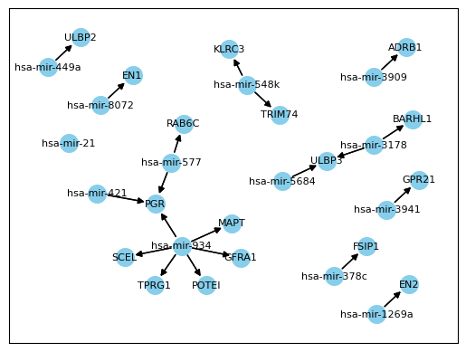

# RNACOREX

RNACOREX is a package that extracts the post-transcriptional coregulation network associated to a specific phenotype. The package filters the input miRNAs and mRNAs using well-known databases such as TargetScan, DIANA and miRTarBase and develops Conditional Linear Gaussian Classifiers (CLGs) to identify the most relevant miRNA-mRNA interactions and classify new samples.

## Requirements

Please, read library instructions before using the library.

## Quickstart

Let start with a basic example. This example is coded in *Examples/QuickStart.ipynb*. See *PLOS Code* for the article code.

Firstly, we will import the required modules.

```python

import pandas as pd

from sklearn.model_selection import train_test_split

import miRNetClassifier

```

Load the dataset *SampleData/SampleDataBRCA* and prepare the data. More example datasets could be found in *SampleData* folder.

```python

# Load the dataset.

data_brca = pd.read_csv('SampleData/SampleDataBRCA.csv', sep = ',', index_col = 0)

# Select expression data (X) and the class (y)

X = data_brca.drop('classvalues', axis = 1)
y = data_brca['classvalues']

# Split the dataset in train and test.

X_train, X_test, y_train, y_test = train_test_split(X, y, test_size=0.3, random_state=1)

```

The `MRNC` estimator has two parameters: `n_con` and `precision`. This two parameters will define the number of interactions of the model and the precision in the functional information estimation process.

The most simple usage of the package is reduced to fit the model to data with `fit()` and show the related network with `get_network()`. By default, the model will be fitted and the network represented with the default number of interactions.

```python

# Initialize estimator with default parameters (precision = 10, n_con = 20)

mrnc = miRNetClassifier.MRNC()

# Fit the model.

mrnc.fit(X_train, y_train)

# Display the coregulation network.

mrnc.get_network()

```
The resulting network:

<p align="center">
  
</p>

Once the model is fitted, several atributes could be accessed.

```python

# Show the structural information.

print(mrnc.structural_information_)

# Show the functional information.

print(mrnc.functional_information_)

# The included micros in the CLG model.

print(mrnc.micros_)

# The included genes in the CLG model.

print(mrnc.genes_)

# The ordered list of interactions with their scores.

print(mrnc.connections_)

# The parameters of the model.

print(mrnc.clgc_)

```

The fitted model can also be used for predictions.

```python

# Predict

mrnc.predict(X_test)

# Predict proba

mrnc.predict_proba(X_test)

```

Instead of doing all the fitting process at one step, it can be done in more steps, allowing a bigger personalization of the model.

```python

# Initialize estimator with default parameters (precision = 10, n_con = 20)

mrnc = miRNetClassifier.MRNC()

# Initialize model and calculate structural information

mrnc.initialize_model(X_train, y_train)

# Calculate functional information. compute_functional() allows to use different X_train and y_train than the ones used for initializing the model.
# This permits, for example, fitting models with different train and test sets without having to initialize the model again.
# The used X_train and y_train sets should have the same variables (microRNA and mRNA) as the ones used in initialize_model().

mrnc.compute_functional()

# Fit the model

mrnc.fit_only()

# Get the network

mrnc.get_network()

```

The fit-predict framework executes the model from an static point of view, with a specific number of interaction defined by the user.

The `structure_search()` function allows to develop networks with 1 to *max_models* interactions and obtain its metrics. The model has to be initialized and the functional information computed beforehand. Train and test samples can be specified or not depending on user requirements. If train sets are not specified the ones included in `initialize_model()` are used. If train sets are specified the variables have to coincide with the ones in `initialize_model()`.

```python

# Search for optimal structure with personalized train and test sets.

mrnc.structure_search(X_train, y_train, X_test, y_test, 100)

# Use only personalized test sets.

mrnc.structure_search(X_test, y_test, 100)

# Use default train sets and no test set.

mrnc.structure_search(100)

# Get metrics.

print(mrnc.structure_metrics_)

```
